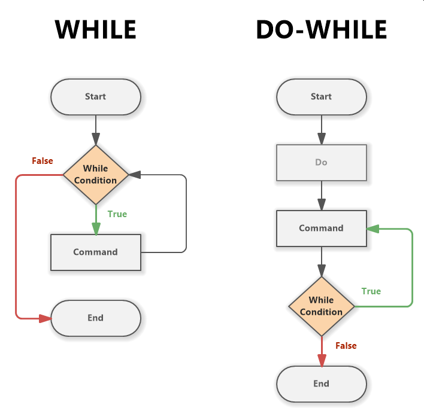
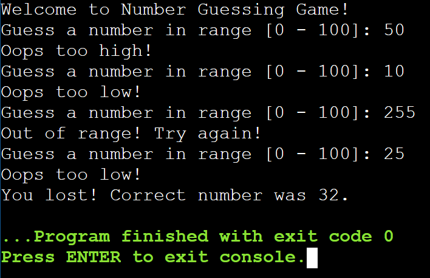
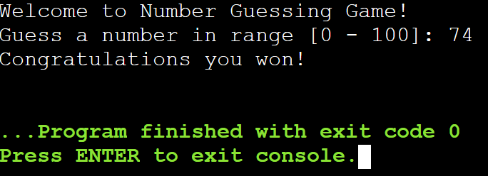

# Lab Assignment 09

In this lab you will practice working with a while loop.

Same as the previous labs, you need to set up your workspace (class and main() method).

## Let's get started!

First, let's look at the name of our .java file in the `src/` directory and name your class accordingly and remember to make it `public`. Next, **create your main() method inside your class**.

Now let's begin!

### While and Do/While Loops

Loops in Java are exactly the same as in C++.

Loops are used to execute a block of code multiple times until a specified condition is met.

Java has two types of while loops, the standard `while` loop and the `do`/`while` loop. In a standard while loop the condition is checked at the beginning and in a do/while loop the condition is checked at the end.

For more information on while and do/while loops in Java visit: https://www.w3schools.com/java/java_while_loop.asp and https://www.w3schools.com/java/java_while_loop_do.asp

### Break and Continue Statements

Both while loops can utilize `break` and `continue` statements.

The `break` statement is used to immediately exit the loop.

The `continue` statement is used to immediately jump to the condition and start a new iteration.

For more information on break and continue statements in Java visit: https://www.w3schools.com/java/java_break.asp

## Your Assignment

### Guessing Game

For this assignment you will create a guessing game. **Generate a random number in range [0 - 100]** and prompt the user to guess that number within the range. 

**Give the user a total of <ins>3 guesses</ins>**. If the user's guess is correct **end the game and congratulate them**, otherwise let the user know their **guess was too high or too low**.

**Note:** If the guess is out of range, output an error messange and <ins>give an extra turn</ins>.

If the user missed all <ins>3 guesses</ins>, let them know they lost and **reveal the random number**.

**Suggested Ouput:**

## Submit your assignment

[Grading Criteria](https://joselitoguardado.dev/3326/labs/Lab_09.pdf)

[How to Submit Assignments to GitHub](https://joselitoguardado.dev/3326/How_to_Submit_Assignments_to_GitHub.pdf)